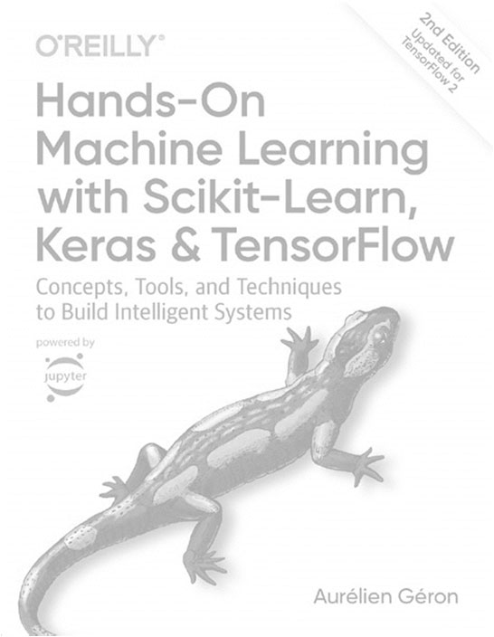
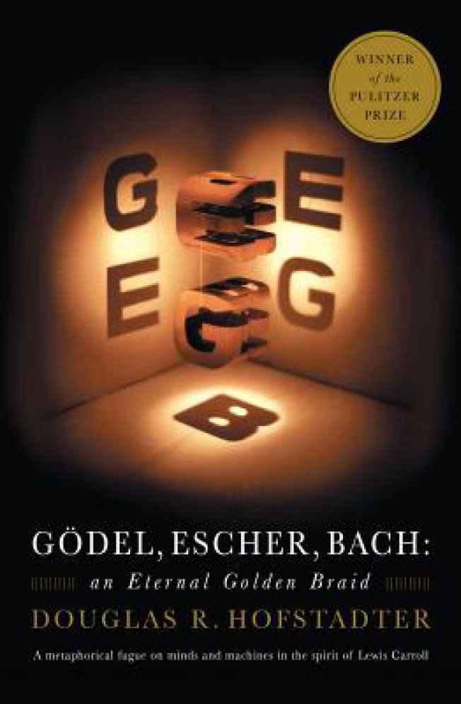
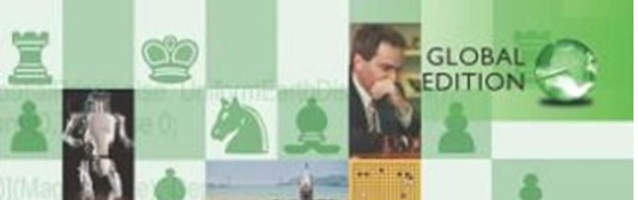
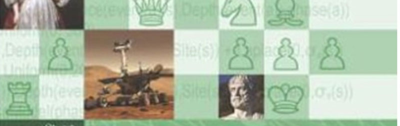
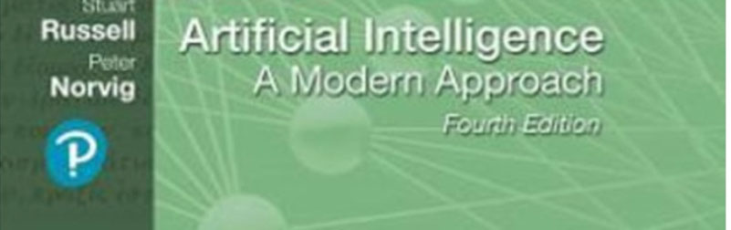

<!-- _class: title-slide -->

# AI Programming
## Bruno Herman

Academiejaar 2024-2025, traject 2AI

---

## Voorstelling

• Lector: bruno.herman@ap.be
• Ik ben bereikbaar via email
• Achtergrond:
• 10 jaar ervaring in IT sector in verschillende rollen
• Analyst, functioneel analyst, data analyst, data scientist
• Voornamelijk transport- en onderzoekssector
• Focus op data & statistiek

---

## Doel van dit opleidingsonderdeel

• Computationeel denken
• Strategie omzetten in implementatie
• Vraagstukken oplossen
• Stevige achtergrond in werking van AI algoritmes en fundamentele definities
• Dit OLOD focust op algoritmes met een specifieke logica, in tegenstelling tot ML algoritmes.

---

## Plaats in de opleiding

• Dit vak bouwt verder op – gebruikt kennis van:
• Python OOP
• Mathematical Foundations
• ML Principles
• Dit is een fundamenteel vak voor jullie opleiding!

---

## Programma

JAAR 1
JAAR 2
JAAR 3
Algemeen IT
AI‐specifiek
Project/Stage
Programming Principles (6)
Databases (3)
Web Technology (3)
Data Networks (3)
Linux (3)
Business Processes (3)
Digital Fundamentals (3)
IoT Experiments (3)
Discover IT (3)
DevOps (3)
Data Presentation (3)
ML Algorithms (6)
Data Engineering (3)
AI Programming (3)
(International) IT Project (9)
IT Professional (3)
Applied AI Project (9)
Minor Project (9)
Bachelorproef & Stage (27)
Web Frameworks (3)
Project Analysis (3)
Minorvak (3)
MLOps (3)
Deep Learning (6)
ICT Architecture (3)
Cyber Security (3)
Web  Programming (6)
Software  Analysis (3)
Communication (3)
Database Programming (3)
Mathematical Foundations (3)
ML Principles (3)
Python OOP (6)
Data Structuren (3)
Big Data (6)
AI for Business (3)
AI & Society (3)
Minorvak (6)
SEMESTER 2
SEMESTER 1

---

## Algemeen verloop

• Theorie: om de twee weken, 2u
• Labo: wekelijks, 2u
• Er zijn 3 projectopdrachten in het jaar. Deze tellen mee voor permanente evaluatie (30%)
• Deze labos maak je in de les, en je mag hiervoor geen
AI-tools zoals ChatGPT gebruiken.
• Dit is telkens een specifiek vraagstuk oplossen mbv technieken besproken in de les, of een specifiek algoritme correct implementeren.
• De beste 2 van de 3 scores worden in rekening genomen.

---

## Praktische afspraken

• ECTS-fiche: https://bamaflexweb.ap.be/BMFUIDetailxOLOD.aspx?a=207715&b=5&c=1
• Toetsing:
• Opdrachten tijdens de lessen: 30%
• Niet herneembaar in tweede zit, score blijft tellen
• Examen in januari:
• Kennis- en inzichtstoets: 30%
• Vaardigheidstoets: 40%
• Tweede zittijd
• Kennis- en inzichtstoets: 30%
• Vaardigheidstoets: 40%
• De score van de opdrachten tijdens de lessen blijft behouden in de tweede zit, niet herhaalbaar

---

## Praktische afspraken - afwezigheden

• De les is niet verplicht, maar de deelevaluaties wel
• Hiervoor moet je je afwezigheid wettigen – zie de
ECTS fiche voor de exacte regels.
• Je verwittigt mij binnen de 4 dagen
• Je attest staat in IBaMaFlex; op tijd
• Je kan maximum 1 deelevaluatie inhalen
•

---

## Praktische afspraken

• Kom op tijd !
• Wees voorbereid
• Zorg dat je de theorieles begrepen hebt als je naar het labo komt

---

## Kalender – onder voorbehoud

Labo installatie
Intro – Intelligent Agents ‐ Sorteringsalgoritmes
LES 1
Labo
‐
LES 2
Labo
Zoekalgoritmes
LES 3
Labo
‐
LES 4
Labo
Zoekalgoritmes continued – Adversarial Search
LES 5
Vaardigheidstoets 23 okt
‐
LES 6
Happy Halloween
Happy Halloween
Labo
Adversarial Search
LES 7
Labo
‐
LES 8
Vaardigheidstoets 20 nov
Lineair Programmeren, convexe optimalisaties
LES 9
Labo
‐
LES 10
Labo
Reinforcement learning
LES 11
Vaardigheidstoets 11 dec
‐
LES 12
Herhalingslabo
Reserve
LES 13

---

## Aanbevolen lectuur

Hands-on Machine Learning –
Aurélien Géron
Artificial Intelligence: a Modern
Approach – Stuart Russell &
Peter Norvig
Gödel, Escher, Bach: an eternal golden braid – Douglas
R. Hofstadter
Deze cursus is sterk gebaseerd op het tweede standaardwerk. De eerste is eerder praktisch, de tweede theoretisch, met adaptaties
Het derde boek geeft een diep inzicht in AI, is eerder filosofisch

De boeken worden aanbevolen als naslagwerk, je hebt ze NIET nodig om deze cursus te volgen
