<!-- _class: title-slide -->

# Reinforcement Learning
## En de ‘Explore vs Exploit’ tradeoff

---

## Introductie

• Tot nu toe keken we naar strategieën waar de agent de spelregels kende (of er toegang tot had)
• Nu kijken we naar problemen waarbij je heel weinig weet over de zoekomgeving waarin de agent zit
• Je hebt wél toegang tot een beloningsfunctie (reward function) – als de agent iets doet, wordt hij daarvoor beloond (met punten) of bestraft (met minpunten)
• Denk aan
• One-armed bandit in een casino

---

## Wat kun je wel doen ?

• Een agent opereert in een omgeving (zie slides van eerste les)

Omgeving reward

AI agent actie

---

## Wat kun je wel doen ?

• Een agent opereert in een omgeving (zie slides van eerste les)
• Zulke systemen werken goed op plaatsen waar de exacte regels of strategieën niet zijn gekend
• Hoe leer je een robot efficiënt stappen ?
• Je geeft hem een beloning als hij sneller wordt
• Je zegt hem niet hoe hij dat moet doen
• Hoe leer je energiesysteem beter verwarmen en koelen ?
• Je beloont hem door een hogere reward te geven bij minder energieverlies
• Chatbots zoals chatGPT leren bij door de ‘thumbs up’ en ‘thumbs down’ die ze krijgen
• Ook dit is een systeem wat mensen gebruiken om elkaar dingen te leren

Omgeving reward

AI agent actie

---

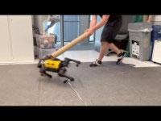

## RL is erg populair in robotica

---

## Reinforcement learning

• Het gekende framework van states en acties
• Er is een state, en de agent kan die state zien
• Er zijn ook acties en een transitiemodel tussen states, maar de agent kent dit niet
• Het is alsof je een spel mag spelen waarvan je de spelregels niet kent, en na 100 zetten wordt er gezegd of je gewonnen hebt of niet. Meer informatie krijg je niet
• Maar voor vele echte problemen is het veel makkelijker om ze op deze manier te formuleren.
• We weten niet exact hoe een robot met 4 poten alles moet regelen om vlot te stappen. We weten wel dat we willen dat hij zo snel mogelijk ergens geraakt (reward!)
• Voor zelfrijdende wagens willen we dat ze ons van A naar B rijden én onderweg geen menselijk / dierlijk leed aanrichten. Dat kunnen we goed in een reward functie zetten.

---

## Wat kun je wel doen ?

• Een agent opereert in een omgeving (zie slides van eerste les)
• Reinforcement learning (RL) bevindt zich op de kruising van
Supervised en unsupervised learning, wat in Machine Learning een courant onderscheid is
• De computer heeft geen voorbeelden gekregen, maar leert uit de eigen verzamelde feedback die het krijgt

Omgeving reward

AI agent actie

---

## Veel of weinig feedback?

• Als je énkel een reward geeft bij het einddoel, dan spreek je van een sparse reward.
• Als je ook tussenliggende doelen beloont, dan wordt het voor de agent makkelijker om te leren, omdat je sneller kan bijsturen
• (Dit is exact de reden waarom ik tussentijdse testen organiseer - met feedback!)
• Vooral in gesimuleerde omgevingen, waar veel data beschikbaar is, zijn
RL systemen populair om de optimale strategie te zoeken, maar dus ook in robotica

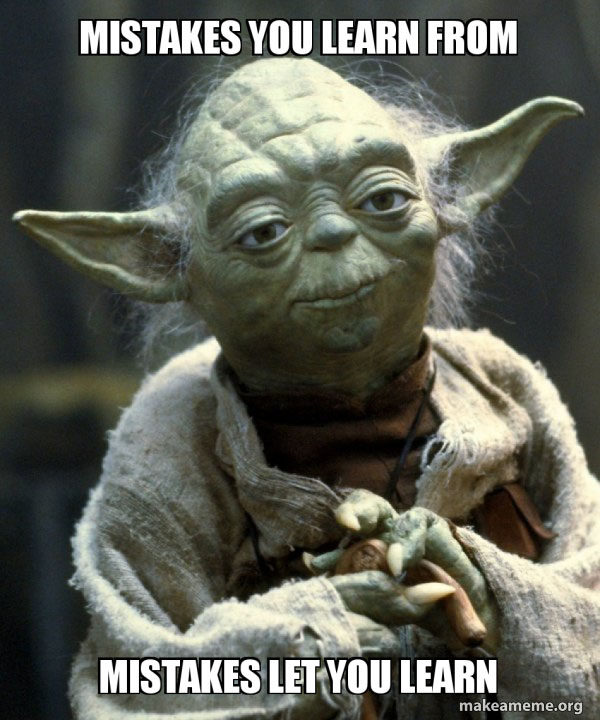

---

## Manieren van leren voor een RL-systeem

Passief leren
• Het model kan enkel ondergaan wat er gebeurt. Welke stappen worden genomen liggen al vast
• Alsof het model naar een video kijkt van zichzelf
Actief leren
• Het model moet zelf beslissen welke stappen het gaat zetten
• Hierbij hoort dus ook de beslissing wélke stap nu interessant is om te nemen

---

## Passief leren

• Het model kan enkel ondergaan wat er gebeurt. Welke stappen worden genomen liggen al vast
• Alsof het model naar een video kijkt van zichzelf
Bijvoorbeeld een robot die een doolhof gaat doorzoeken, en videos heeft van vorige robots die rondliepen in het doolhof

---

## Actief leren

• Het model moet zelf beslissen welke stappen het gaat zetten
• Hierbij hoort dus ook de beslissing wélke stap nu interessant is om te nemen
• Dit is minder evident dan het lijkt. Wij nemen zelf elke dag dit soort beslissingen

---

## Reinforcement learning - demo

• Demo: mountain car
• Het doel van deze kar is het vlaggetje bereiken
• De kar kent ‘de spelregels’ niet: het kent geen zwaartekracht, weet niet wat remmen en versnellen is
• Het heeft wel veel tijd en zal veel (moeten) proberen

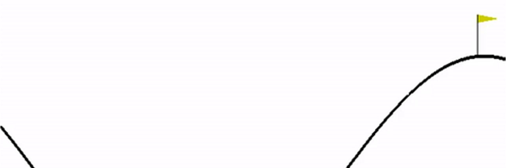

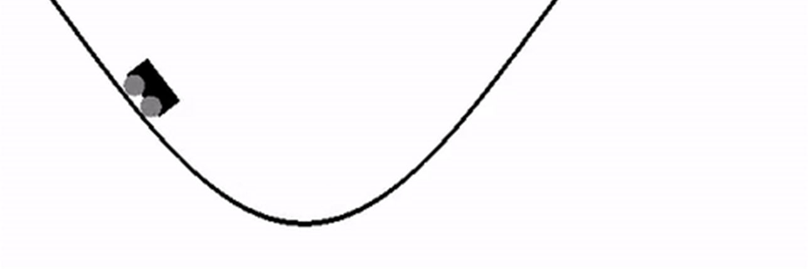

---

## Nog wat voorbeeldjes

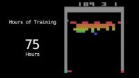

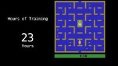

---

## Explore vs exploit

Een laatste keer naar Las Vegas

---

## Explore vs Exploit

• Wanneer kies je een restaurant dat je al kent, wanneer kies je een nieuw restaurant ?
• Hoe weet je wanneer het best is om iets nieuw te proberen, of te blijven bij wat je al kent ?
• Dit dilemma heet het ‘explore vs exploit’ dilemma

---

## Explore vs Exploit

• Explore is het bekijken van nieuwe, ongekende opties om informatie te verkrijgen
• Exploit is volgens je huidige kennis de beste keuze maken

---

## Casino – One-armed bandits

• We gaan een laatste keer naar het casino.
• Er is een rij van one-armed bandits. Dit is een machine die, nadat je hebt betaald, simpelweg niks teruggeeft of al het geld in kassa teruggeeft. Ze zijn veel te vinden in Las Vegas en andere gokparadijzen.
• Elke bandit heeft een vaste, bepaald kans 𝑟௜om bij het trekken van de hendel je bedragen terug te geven
• Die rates ken je niet op voorhand!
• Wat is een goede strategie ? Wanneer wissel je van toestel ?

---

## Casino – One-armed bandits

• Het is duidelijk dat de beste strategie een combinatie is van nieuwe machines proberen, en de beste machine vaak gebruiken om zoveel mogelijk payouts te krijgen.
• Maar hoe vind je de balans tussen die twee ?
• Wat is een goede strategie ?

---

## Casino – One-armed bandits

• Je kan best van elke machine bijhouden hoe vaak je hebt gespeeld en hoe vaak je bent uitbetaald.
Je kan op basis daarvan een schatting maken van de payout rate van die machine.
• Bijvoorbeeld 10 keer gespeeld, 2 keer gewonnen op machine 2 geschatte payout rate
20%
• Wat is een goede strategie ?

---

## Casino – One-armed bandits

• Je kan best van elke machine bijhouden hoe vaak je hebt gespeeld en hoe vaak je bent uitbetaald. Je kan op basis daarvan een schatting maken van de payout rate van die machine.
• Bijvoorbeeld 10 keer gespeeld, 2 keer gewonnen op machine 2 geschatte payout rate 20%
• Maar zou je een machine met statistieken 50/100 verkiezen boven een machine 2/5 ?
• Wat is een goede strategie ?

---

## Explore vs exploit: de gittins index

• De oplossing voor dit probleem werd gevonden door John Gittins in 1979.
• Hij gaf een manier om voor elke combinatie van pogingen/successen een
Gittins-index op te stellen
• De strategie is om telkens naar die bandit te gaan met de hoogste index
• De berekening gebruikt discounting: een win vandaag is meer waard dan een win morgen. Dit kan je intuitief verklaren omdat je niet zeker weet of het restaurant morgen nog bestaat, of in een dramatischere versie, of je zelf morgen nog leeft. In de tabel zie je een discounting factor opduiken, dat is typisch een getal tussen 0,9 en 0,9999.

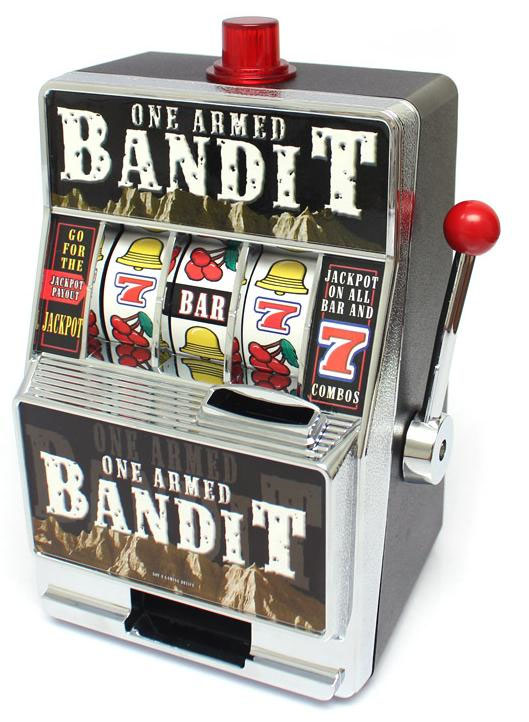

---

## Gittins index

---

## Gittins index

---

## Gittins index

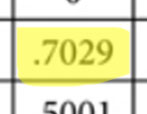

0-0 is een niet-geteste bandit. Dus zelfs als je een bandit hebt die zeker 50-50 winst geeft, dan nog is het slimmer om iets nieuw te proberen !!

---

## Explore vs exploit in het dagelijks leven

Explore
• Studeer !
• Investeer !
• Lange termijn doelen stellen
Exploit
• ‘Pluk de dag’
• ‘geniet van elke dag’
• …
• Korte termijn beloningen

---

## Explore vs exploit in het dagelijks leven

• In het begin van een citytrip moet je alles nog ontdekken
• In het begin van je professionele carrière kan je nog heel veel proberen en veranderen van job
• De laatste dag keer je misschien liever terug naar het beste restaurant / café / uitgaansbuurt van de week dat je er was
• Naarmate je beter ‘leert’ hoe de jobwereld eruitziet, ben je meer geneigd om bij een bepaalde (goede!) job te blijven

---

## Reinforcement learning en zelfrijdende auto

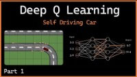

---

## AI

Een kleine geschiedenis

---

## Een kleine geschiedenis van AI

1950: Turing Test 1956: term Artificiële
Intelligentie
1966: Eliza: eerste chatbot
2011: SIRI
2011: Watson
2017: AlphaGo
Nov 2022: chatGPT
1997: Deep Blue
1999: Sony AI Robot
AIBO
2006: Google Translate
Eerste AI
Winter
Tweede AI
Winter

---

## Een kleine geschiedenis van AI

1950: Turing Test 1955: term Artificiële
Intelligentie
1966: Eliza: eerste chatbot
2011: SIRI
2011: Watson
2017: AlphaGo
Nov 2022: chatGPT
1997: Deep Blue
1999: Sony AI Robot
AIBO
2006: Google Translate
Eerste AI
Winter
Tweede AI
Winter cvc cvc cvc

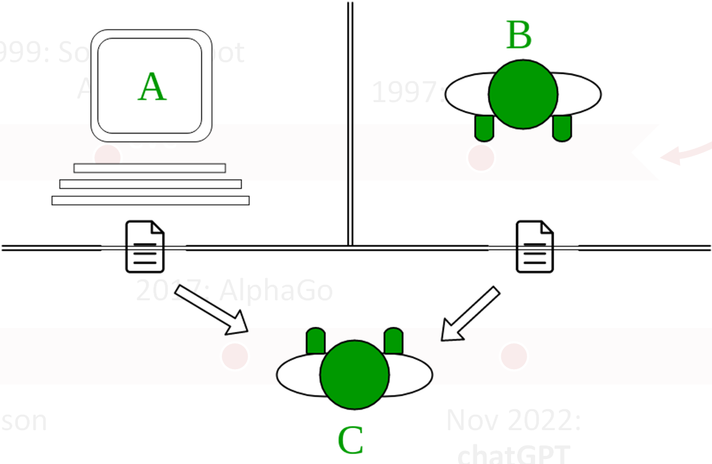

1950: Alan Turing ontwikkelt de Turing Test

---

## Een kleine geschiedenis van AI

1950: Turing Test 1955: term Artificiële
Intelligentie
1966: Eliza: eerste chatbot
2011: SIRI
2011: Watson
2017: AlphaGo
Nov 2022: chatGPT
1997: Deep Blue
1999: Sony AI Robot
AIBO
2006: Google Translate
Eerste AI
Winter
Tweede AI
Winter cvc cvc cvc 1956: term Artificiële
Intelligentie, door John
McCarthy op
Darthmouth

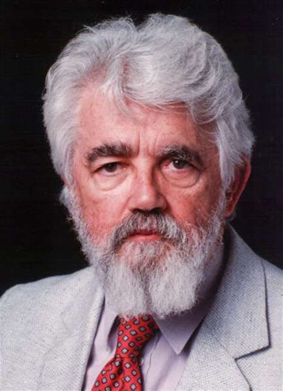

---

## Een kleine geschiedenis van AI

1950: Turing Test 1955: term Artificiële
Intelligentie
1966: Eliza: eerste chatbot
2011: SIRI
2011: Watson
2017: AlphaGo
Nov 2022: chatGPT
1997: Deep Blue
1999: Sony AI Robot
AIBO
2006: Google Translate
Eerste AI
Winter
Tweede AI
Winter cvc cvc cvc
1966: Eliza: eerste chatbot, die een psychotherapeut simuleert

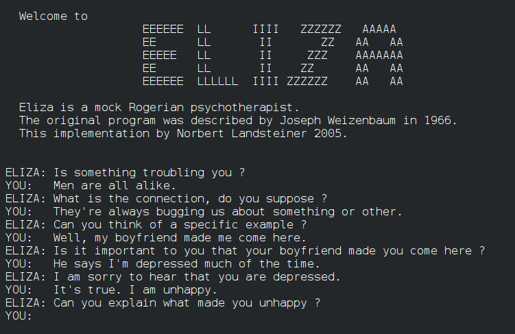

---

## Een kleine geschiedenis van AI

1950: Turing Test 1955: term Artificiële
Intelligentie
1966: Eliza: eerste chatbot
2011: SIRI
2011: Watson
2017: AlphaGo
Nov 2022: chatGPT
1997: Deep Blue
1999: Sony AI Robot
AIBO
2006: Google Translate
Eerste AI
Winter
Tweede AI
Winter cvc cvc cvc
Eerste AI
Winter

De ontwikkeling van AI kwam wat tot stilstand door gebrek aan rekenkracht

---

## Een kleine geschiedenis van AI

1950: Turing Test 1955: term Artificiële
Intelligentie
1966: Eliza: eerste chatbot
2011: SIRI
2011: Watson
2017: AlphaGo
Nov 2022: chatGPT
1997: Deep Blue
1999: Sony AI Robot
AIBO
2006: Google Translate
Eerste AI
Winter
Tweede AI
Winter cvc cvc cvc

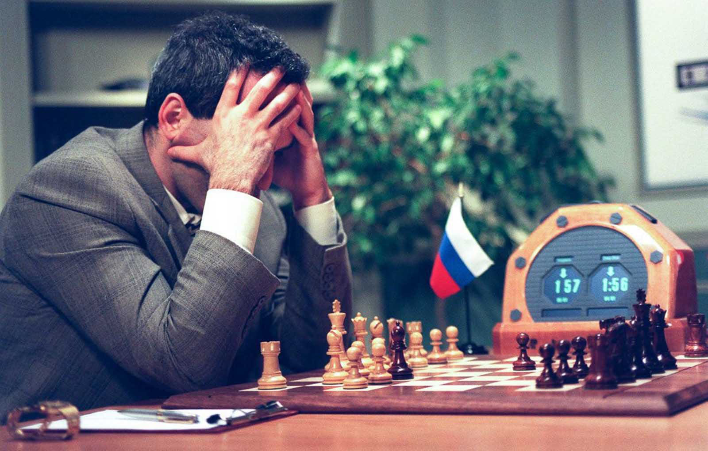

1997: Deep Blue verslaat Garry Kasparov – het verdient te vermelden dat er een significante hardware upgrade nodig was, bij de eerste poging in 1996 won Kasparov

---

## Een kleine geschiedenis van AI

1950: Turing Test 1955: term Artificiële
Intelligentie
1966: Eliza: eerste chatbot
2011: SIRI
2011: Watson
2017: AlphaGo
Nov 2022: chatGPT
1997: Deep Blue
1999: Sony AI Robot
AIBO
2006: Google Translate
Eerste AI
Winter
Tweede AI
Winter cvc cvc cvc
1999: Sony AI Robot
AIBO: eerste betaalbare robot

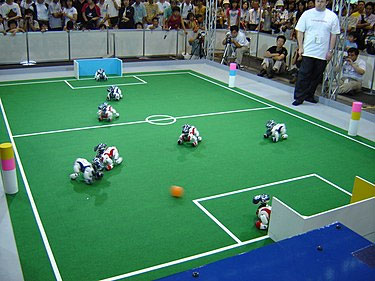

---

## Een kleine geschiedenis van AI

1950: Turing Test 1955: term Artificiële
Intelligentie
1966: Eliza: eerste chatbot
2011: SIRI
2011: Watson
2017: AlphaGo
Nov 2022: chatGPT
1997: Deep Blue
1999: Sony AI Robot
AIBO
2006: Google Translate
Eerste AI
Winter
Tweede AI
Winter cvc cvc cvc
2006: Google Translate
Eerst als een statistisch taalmodel, in 2016 overgestapt naar een neuraal netwerk (deep learning)

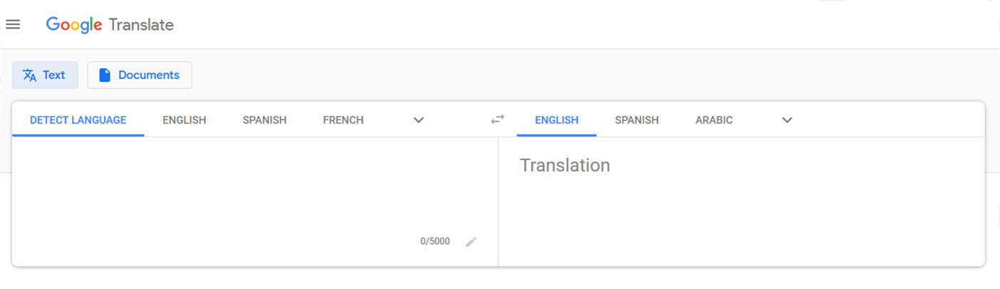

---

## Een kleine geschiedenis van AI

1950: Turing Test 1955: term Artificiële
Intelligentie
1966: Eliza: eerste chatbot
2011: SIRI
2011: Watson
2017: AlphaGo
Nov 2022: chatGPT
1997: Deep Blue
1999: Sony AI Robot
AIBO
2006: Google Translate
Eerste AI
Winter
Tweede AI
Winter cvc cvc cvc
Tweede AI
Winter

Na de eerste successen was het wachten op nieuwe technieken om meer nuttige toepassingen te verkrijgen

---

## Een kleine geschiedenis van AI

1950: Turing Test 1955: term Artificiële
Intelligentie
1966: Eliza: eerste chatbot
2011: SIRI
2011: Watson
2017: AlphaGo
Nov 2022: chatGPT
1997: Deep Blue
1999: Sony AI Robot
AIBO
2006: Google Translate
Eerste AI
Winter
Tweede AI
Winter cvc cvc cvc
2011: SIRI geïntroduceerd op iPhone, een digitale assistent met geavanceerde spraak‐ herkenning

---

## Een kleine geschiedenis van AI

1950: Turing Test 1955: term Artificiële
Intelligentie
1966: Eliza: eerste chatbot
2011: SIRI
2011: Watson
2017: AlphaGo
Nov 2022: chatGPT
1997: Deep Blue
1999: Sony AI Robot
AIBO
2006: Google Translate
Eerste AI
Winter
Tweede AI
Winter cvc cvc cvc 2011: de Watson supercomputer wint het spelprogramma ‘Jeopardy’

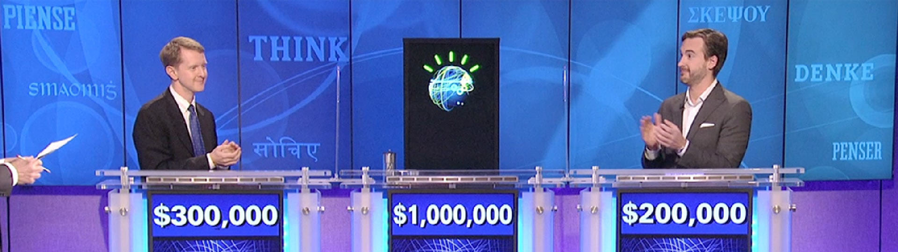

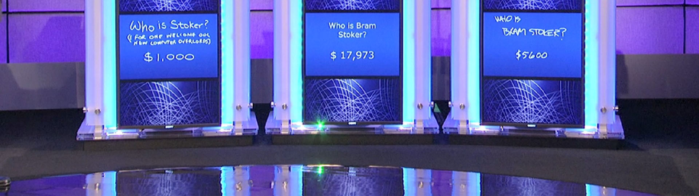

---

## Een kleine geschiedenis van AI

1950: Turing Test 1955: term Artificiële
Intelligentie
1966: Eliza: eerste chatbot
2011: SIRI
2011: Watson
2017: AlphaGo
Nov 2022: chatGPT
1997: Deep Blue
1999: Sony AI Robot
AIBO
2006: Google Translate
Eerste AI
Winter
Tweede AI
Winter cvc cvc cvc
2017: AlphaGo verslaat Sedol
Lee in het bordspel Go dankzij een (heel) diep neural netwerk

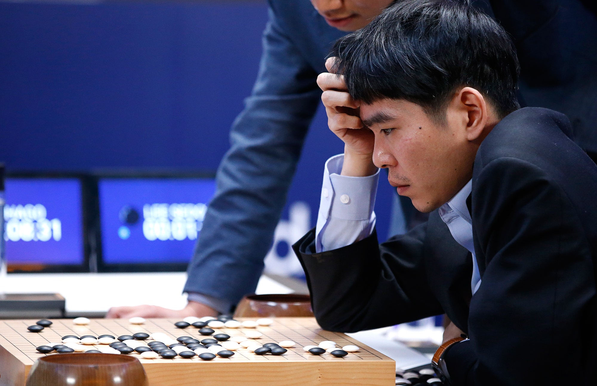

---

## Een kleine geschiedenis van AI

1950: Turing Test 1955: term Artificiële
Intelligentie
1966: Eliza: eerste chatbot
2011: SIRI
2011: Watson
2017: AlphaGo
Nov 2022: chatGPT
1997: Deep Blue
1999: Sony AI Robot
AIBO
2006: Google Translate
Eerste AI
Winter
Tweede AI
Winter cvc cvc cvc 2022: chatGPT

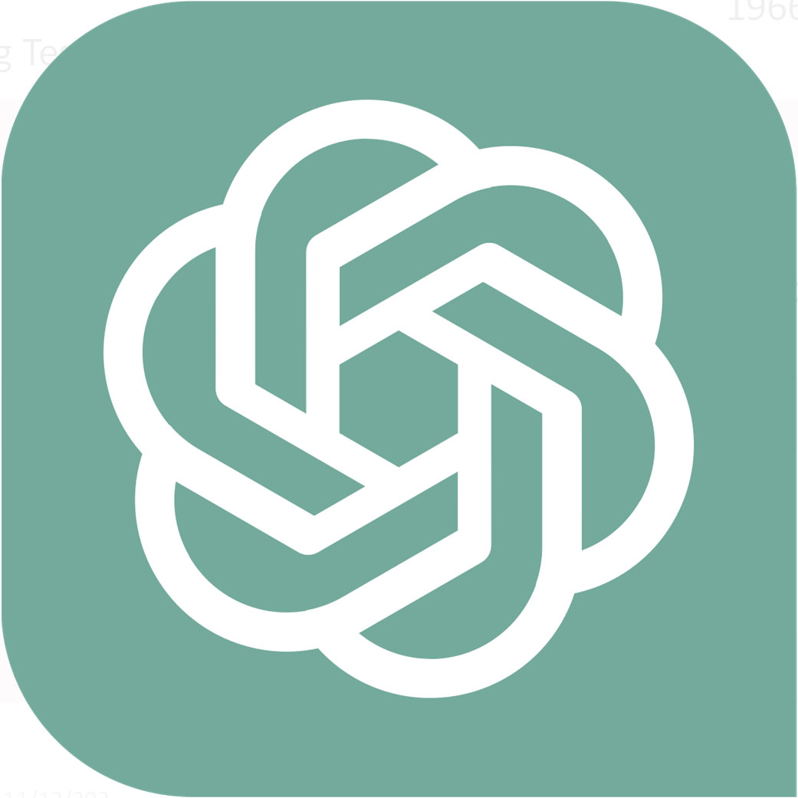

---

## Een kleine geschiedenis van AI

1950: Turing Test 1956: term Artificiële
Intelligentie
1966: Eliza: eerste chatbot
2011: SIRI
2011: Watson
2017: AlphaGo
Nov 2022: chatGPT
1997: Deep Blue
1999: Sony AI Robot
AIBO
2006: Google Translate
Eerste AI
Winter
Tweede AI
Winter
