<!-- _class: title-slide -->

# Lokale zoekalgoritmes

---

## Iets complexere problemen

• Tot nu toe hebben we ons beperkt tot deterministische, volledig observeerbare problemen.
• In dit hoofdstuk gaan we dit lichtjes uitbreiden om meer realistische problemen op te lossen
• We gaan nu kijken naar zoekalgoritmes waarbij enkel de eindoplossing telt, niet zozeer het pad naar die oplossing

---

## Local search

• Local search gebruikt minder geheugen, het slaat geen informatie op
• Is niet systematisch
• Vindt vaak wel een goede oplossing, zelfs in grote zoekruimtes
• De kunst is om niet in een lokaal minimum vast komen te zitten
• Hieronder hebben we bijvoorbeeld een kostfunctie. Je wil het punt vinden met minimale kost voor je probleem

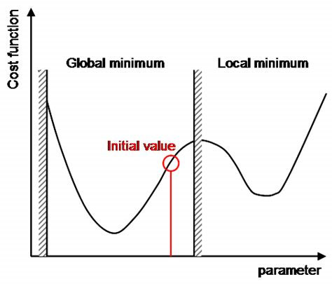

---

## Verband tussen ‘zoeken’ en optimaliseren

• Een ‘zoekprobleem’ kan je vaak herfomuleren naar een optimalisatieprobleem
• Hiervoor moet je dan een goede performance metric hebben (P uit
PEAS) – ook wel kostfunctie genoemd
• De oplossing van je zoektocht is dan het minimaliseren van die functie

---

## Voorbeeld van kostfuncties

• De meest gebruikte kostfunctie is de zogenaamde
‘Euclidische afstand’, of het kwadraat ervan
• ଵ
ଶ, …, ௡
ଵ
ଶ, …, ௡
௜
௜ଶ
௡
௜ୀଵ

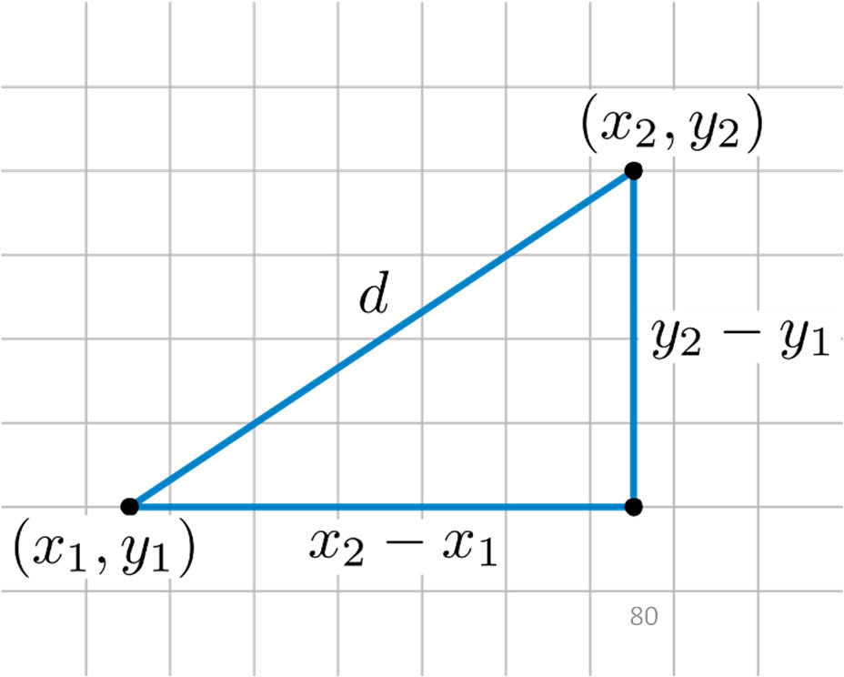

Dit is niets meer of minder dan de ‘afstand in vogelvlucht’ tussen die punten
Vaak wordt om berekening te versimpelen de vierkantswortel weggelaten. Dit concept komt vaak terug, onder andere in Machine Learning scoringsmetrieken zoals Mean Squared Error
(MSE)

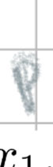

---

## Optimalisatie van functies

• Welk algoritme kennen jullie om de minimum van een functie te zoeken ?
• Hoe werkt dat algoritme ?

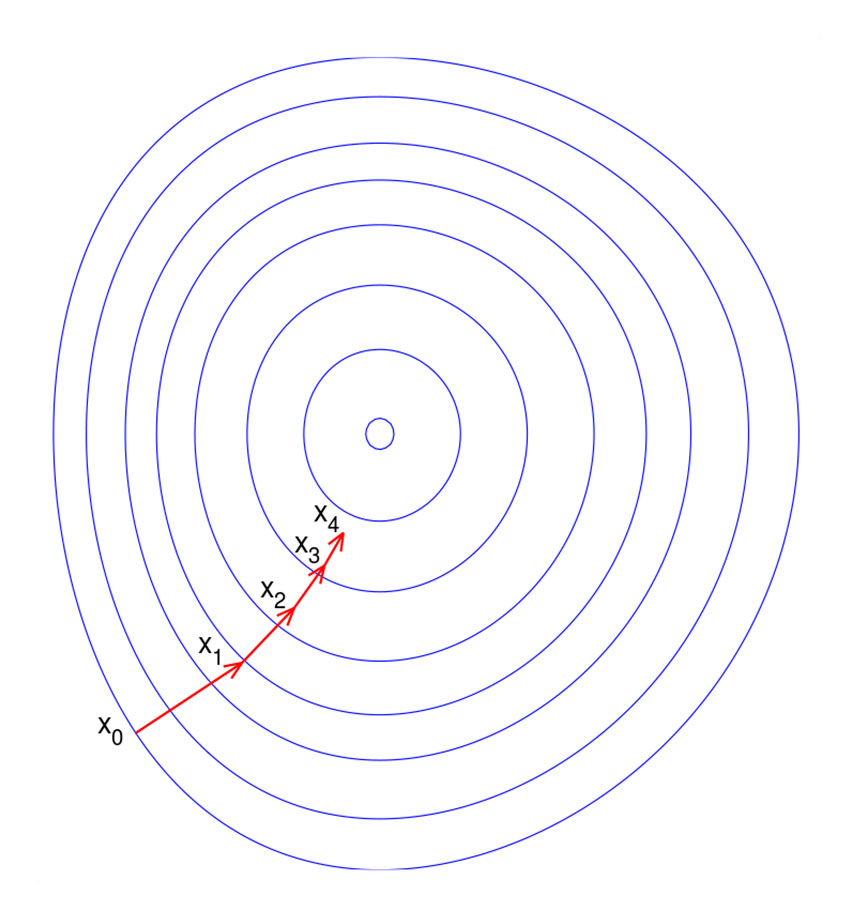

---

## Gradient Descent

• Gradient descent is een algoritme om op zoek te gaan naar een minimum.
• Het berekent op elk punt de verschillende partiële afgeleiden en zoekt zo de richting die het meest veelbelovend is voor de volgende stap
• Het zet een stap (met een bepaalde grootte) in de richting.
• Gradient descent werkt dus enkel goed op functies die goed ‘afleidbaar’ zijn
• Er is altijd het risico in een lokaal minimum te blijven steken

---

## Gradient Descent

• Gradient descent is een algoritme om op zoek te gaan naar een minimum.
• Het berekent op elk punt de verschillende partiële afgeleiden en zoekt zo de richting die het meest veelbelovend is voor de volgende stap
• Het zet een stap (met een bepaalde grootte) in de richting.
• Het stopt wanneer er niets meer verandert
• Implementatie
• # Gradient descent x = initial_x converged = False while not converged: y = cost_function(x) grad = gradient(x) new_x = x ‐ learning_rate * grad if np.abs(new_x ‐ x) < convergence_threshold: converged = True x = new_x

---

## Gradient Descent

• Gradient descent is een ‘greedy algorithm’: het kiest op elke stap de op dat moment beste richting, zelfs indien je dan in een lokaal minimum dreigt verzeild te raken

Bij gradient descent moet je vaak een stapgrootte of ‘learning rate’ meegeven

---

## Gradient Descent

• Bij een te hoge learning rate kun je over de oplossing springen. Een lagere learning rate is veiliger, maar duurt langer.
Bovendien kan je nog steeds blijven steken op
• Plateau
• ‘Ridge’, een opeenvolging van lokale minima

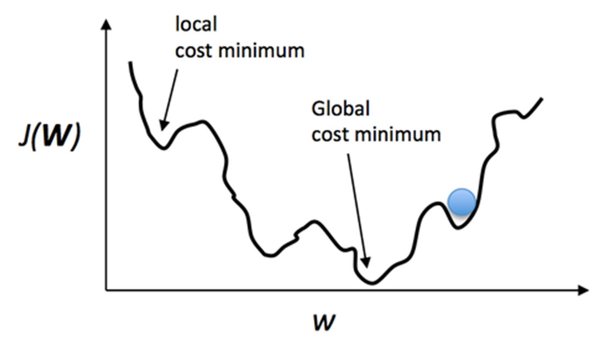

Bij gradient descent moet je vaak een stapgrootte of ‘learning rate’ meegeven

---

## Gradient Descent

• (Demo)

---

## Gradient Descent variaties

• Stochastic gradient descent
• Kies een richting, waarbij de kansverdeling van de richting bepaald wordt door de gradiënt
• First-choice gradient descent: indien er veel verschillende states zijn, sample nieuwe vectors totdat er een betere richting is (niet per se optimaal!)
• Random restart – een paar keer opnieuw blijven proberen
• Lokale minima blijven een probleem, omdat gradient descent niet even ‘naar boven durft gaan’ alvorens verder af te dalen
• Je zou, in theorie, in random richtingen kunnen wandelen en uiteindelijk de oplossing vinden. Dit is natuurlijk héél inefficiënt
• Als oplossing is er een ander algoritme, ‘simulated annealing’

---

## Simulated annealing

• Een soort combinatie van gradient descent en ‘willekeurige dingen proberen’
• Het komt erop neer dat we af en toe ‘schudden’ met de situatie om het algoritme de kans te geven naar boven te gaan
• Hoe verder in het algoritme, hoe minder hard we schudden

‘Annealing’ is in de metaalbewerking een techniek om metaal op te warmen (verhogen) en vervolgens af te koelen om het materiaal sterker te maken

---

## Simulated annealing

• Pseudocode , E is de te minimaliseren functie
• Startwaarde s = s0
• For k = 0 tot kmax:
• T = temperature( 1 - (k+1)/kmax )
• Kies aan random state vanuit s: snew ← valid_state(s)
• Als E(snew) < E(s)
• s ← snew
• Else If P(E(s), E(snew), T) ≥ random(0, 1):
• s ← snew
• Als E(sbest) > E(s): sbest ← s
• Output: de finale staat s
We gaan ‘soms’ toelaten de verkeerde richting uit te wandelen. Die ‘soms’ is gecapteerd in de kansfunctie P, waarbij de kans kleiner wordt ,naarmate de temperatuur T afneemt

---

## Simulated annealing

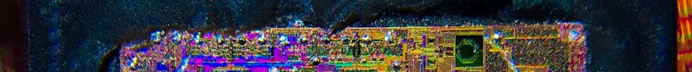

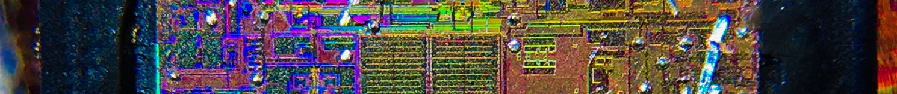

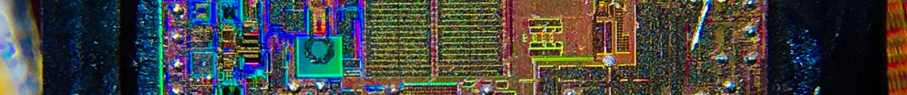

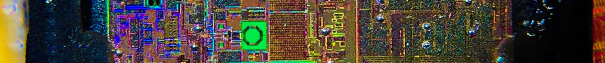

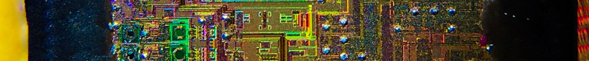

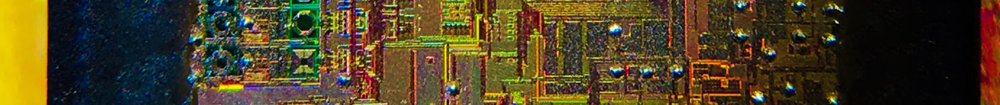

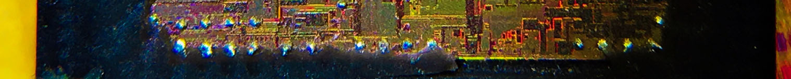

• Simulated annealing is historisch erg belangrijk
• Het was in de jaren 80 dé techniek om te weten hoe je optimaal circuits op borden moest ordenen – het zogenaamde Very Large Scale
Integration layout probleem voor integrated circuits (ICs) op een chip. Het heeft bijgedragen aan de chipontwikkeling voor tientallen jaren

---

## In puzzels & spellen

• vaak geen continue, maar een discrete functie
• Een ‘stapfunctie’
• Gradient descent is dan helaas niet bruikbaar, want deze functies zijn niet afleidbaar
• In dat geval kun je van het typisch eindig aantal stappen, de beste optie nemen
• Hebben we al eens gedaan voor de schuifpuzzel.
