<!-- _class: title-slide -->

# Adversial games

---

## Multi-agent systemen

• Spellen zoals poker, schaken, dammen, …
• Soorten spellen
• Perfect / Inperfect
• Zero-sum games: er is 1 wanneer, de rest verliest
• Wij bekijken in eerste instantie zero-sum, 2-player, perfect information games

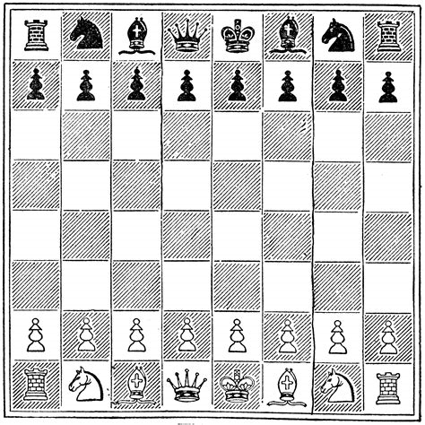

---

## Two-player zero-sum games

• Een spel is gekenmerkt door:
• Initiële state
• Wie aan beurt is
• Mogelijke acties per state
• Transitie model als resultaat van acties
• Terminal test: er moet een procedure zijn om te checken of het spel klaar is, er zijn vele terminal states
• Utility functie:
• Winnaar 1, verliezer 0, draw ½ of iets dergelijke
• Game tree van een spel
• Voor elke move de volgende legale moves
• Wordt al snel erg groot.
• Heel gelijkaardig aan de state space, alleen zijn er nu 2 spelers die afwisselend iets doen.
• Je hebt het gedrag van de tegenspeler niet onder controle. We gaan er wel vanuit de speler ‘perfect’ kan spelen

---

## Game tree van enkele strategieën in schaken

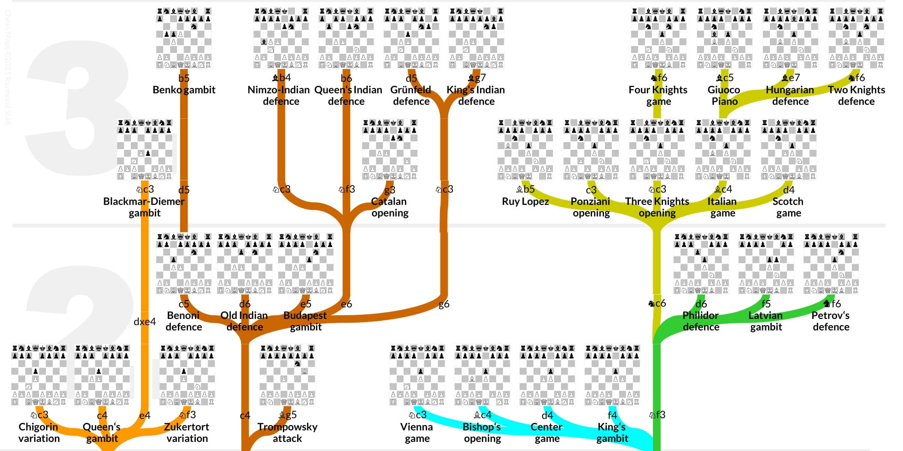

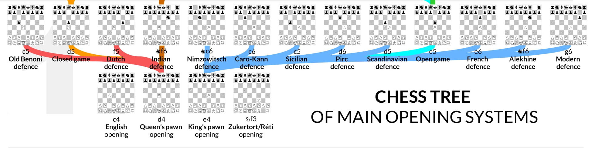

---

## Voorbeeld: Tic Tac Toe

---

## Twee spelers, 2 strategieën

Speler 1 = ‘Max’
• Max wil een terminale staat waarbij hij wint, dus met utility +1
• In een niet-terminale staat, wil Max juist die actie kiezen die leidt naar een staat met maximale utility
• Eg, achterwaarts redenen
Speler 2 = ‘Min’
• Min wil naar een minimale utility streven (-1)

---

## Minimax Algoritme voor Tic Tac Toe

X
O
X
0
X
O
X
X
O
X
0
X
O
X
X
O
X
0
X
O
X
X
O
X
0
X
O
O
X
X
O
X
0
X
O
X
X
O
O
X
0
X
O
X
X
X
O
O
X
0
X
O
X
O
X
O
X
0
X
O
X
X
O
O
X
0
X
O
X
O
X
X
O
X
0
X
O
X
X
X
O
O
X
0
X
O
O
X
X
O
X
0
X
O
O
X
X
O
X
0
X
O
X
O
X
X
O
X
0
X
O
X aan zet
X aan zet
O aan zet

---

## Minimax Algoritme voor Tic Tac Toe

X
O
X
0
X
O
X
X
O
X
0
X
O
X
X
O
X
0
X
O
X
X
O
X
0
X
O
O
X
X
O
X
0
X
O
X
X
O
O
X
0
X
O
X
X
X
O
O
X
0
X
O
X
O
X
O
X
0
X
O
X
X
O
O
X
0
X
O
X
O
X
X
O
X
0
X
O
X
X
X
O
O
X
0
X
O
O
X
X
O
X
0
X
O
O
X
X
O
X
0
X
O
X
O
X
X
O
X
0
X
O
X aan zet
X aan zet
O aan zet
MAX
MAX
MIN
MIN

---

## Minimax Algoritme voor Tic Tac Toe

X
O
X
0
X
O
X
X
O
X
0
X
O
X
X
O
X
0
X
O
X
X
O
X
0
X
O
O
X
X
O
X
0
X
O
X
X
O
O
X
0
X
O
X
X
X
O
O
X
0
X
O
X
O
X
O
X
0
X
O
X
X
O
O
X
0
X
O
X
O
X
X
O
X
0
X
O
X
X
X
O
O
X
0
X
O
O
X
X
O
X
0
X
O
O
X
X
O
X
0
X
O
X
O
X
X
O
X
0
X
O
X aan zet
X aan zet
O aan zet
MAX
MAX
MIN
MIN
+1
+1
+1
+1
0
‐1
‐1
‐1
‐1
0
0
0
0
0

---

## Minimax Algoritme

• Werkt voor perfect information games, met beperkte game tree
• Bij grotere problemen gaat het feit dat we heel de tree moeten doorzoeken een probleem worden
• Hier komen we volgende les op terug!

---

## Depth-limited search

---

## Wat als de game tree te groot is ?

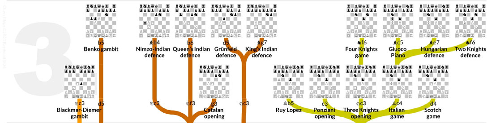

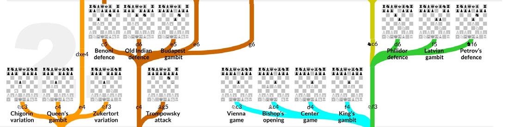

• Bijna altijd is de game tree van een spel veel te groot om helemaal recursief door te rekenen.
• We bespreken 3 variaties van minimax die hier een oplossing kunnen bieden

---

## Grootte van een (game) tree

• Om de grootte van een tree aan te duiden:
• Branching factor: het gemiddeld aantal opties op elke node
• Depth: diepte van de boom
• Deze twee getallen bepalen grofweg hoe breed en hoe lang de boom is.
• TicTacToe heeft een branching van ongeveer 4.5, en een maximale depth van 9. Dit is heel klein

---

## Limited depth

• In de implementatie van
Tic tac Toe zie je al een depth parameter die wordt meegesleept in het algoritme.
• Je kan deze gebruiken om maximaal een aantal levels diep te zoeken if is_maximizing: best = ‐2 # laag genoeg beginnen for i in range(3): for j in range(3): if self.board[i][j] == ' ':
# X invullen en checken wat er dan precies zou gebeuren, recursieve definitie new_move = self.copy() new_move.board[i][j] = 'X' best = max(best, new_move.minimax(depth + 1, not is_maximizing)) #tegengestelde positie

---

## Limited depth

• Je kan je algoritme dan aanpassen om na maximaal 5 levels diep te stoppen
• Maar:
• Op 5 levels diep heb je mogelijk géén terminale staat
• Maar je wil daar toch een waarde teruggeven... if is_maximizing: best = ‐2 # laag genoeg beginnen for i in range(3): for j in range(3): if self.board[i][j] == ' ':
# X invullen en checken wat er dan precies zou gebeuren, recursieve definitie new_move = self.copy() new_move.board[i][j] = 'X' best = max(best, new_move.minimax(depth + 1, not is_maximizing)) #tegengestelde positie

---

## Limited depth

• Je kan je algoritme dan aanpassen om na maximaal 5 levels diep te stoppen
• Je hebt dan op elk ogenblik een inschatting nodig van hoe goed een huidige bordpositie is
• Schaken: (aantal stukken van jezelf) – (aantal stukken tegenstander)
• Risk: hoeveel regio's je bezet (evt met zwaarte leger)
• Catan en veel andere spellen: hoeveel punten je al hebt
• ...

---

## Limited depth – een voorbeeld voor schaken

---

## Uitbreiden 'evaluate' functie

• In onze code hadden wij voorlopig bij 'evaluate' enkel de terminale states:
• 1 voor winst
• -1 voor verlies
• 0 voor gelijkspel
• Een nieuwe evaluatiefunctie moet nu voor élk spelbord een schatting kunnen maken
Deze functie noemen we ook wel de 'utility' functie.
Hoe hoger de utility, hoe beter

---

## Utility functie voor schaken

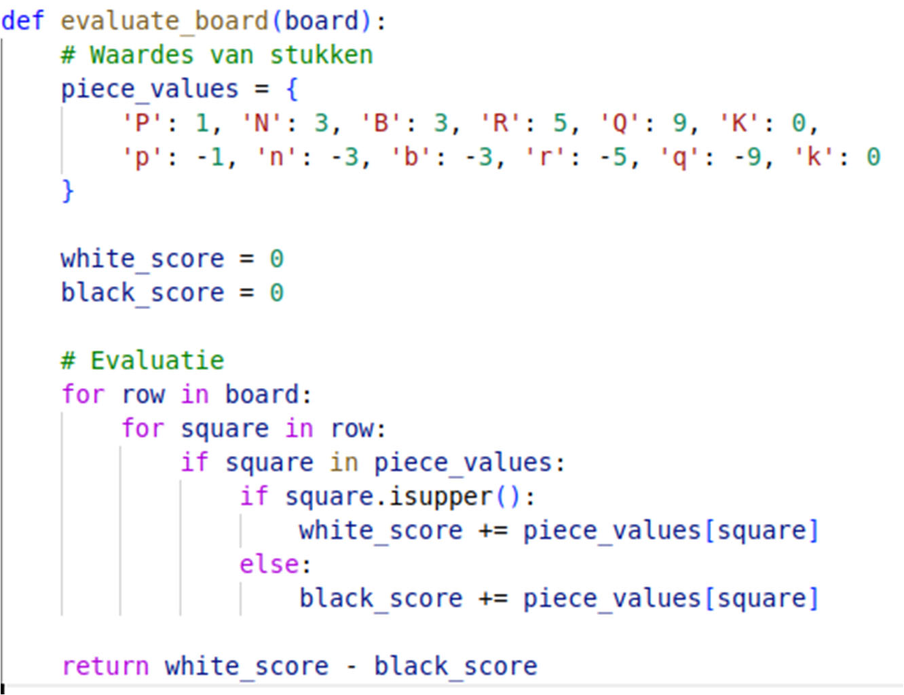

---

## Utility functie

• Het werken met een utility functie is nodig om limited depth minimax te kunnen doen
• Het heeft een belangrijk nadeel: de oplossing is niet meer perfect, en sterk afhankelijk van hoe goed de utility function is geïmplementeerd
• Hier onstaat een afweging:
• De utility moet een goede waarde kunnen geven van een spelbord
• Maar het mag ook niet te lang duren om deze te berekenen

---

## Schaakcode (demo)

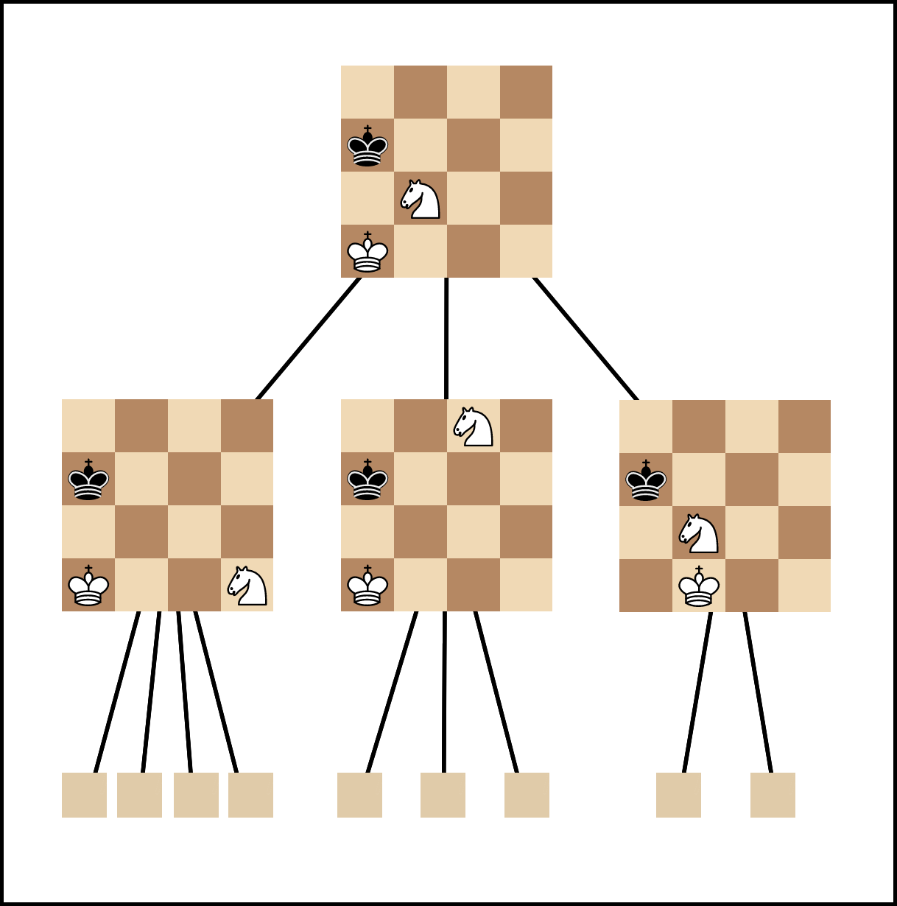

---

## Alpha Beta Pruning

Snoeien in de game tree

---

## Alpha Beta pruning

• Er zijn in veel game trees bepaalde shortcuts te nemen
• Door die shortcuts uit te buiten, moeten we bepaalde stukken van de game tree niet onderzoeken.
• Dit kan ons veel tijd besparen!
• We beschouwen als voorbeeld even terug de
TicTacToe tree op volgende slides.
• Het algoritme, zoals het is ontworpen, werkt zich depth-first naar beneden

---

## Minimax Algoritme voor Tic Tac Toe

X
O
X
0
X
O
X
X
O
X
0
X
O
X
X
O
X
0
X
O
X
X
O
X
0
X
O
O
X
X
O
X
0
X
O
X
X
O
O
X
0
X
O
X
X
X
O
O
X
0
X
O
X
O
X
O
X
0
X
O
X
X
O
O
X
0
X
O
X
O
X
X
O
X
0
X
O
X
X
X
O
O
X
0
X
O
O
X
X
O
X
0
X
O
O
X
X
O
X
0
X
O
X
O
X
X
O
X
0
X
O
X aan zet
X aan zet
O aan zet
MAX
MAX
MIN
MIN
+1
+1
+1
+1
0
‐1
‐1
‐1
‐1
0
0
0
0
0

---

## Minimax Algoritme voor Tic Tac Toe – a-b pruning

X
O
X
0
X
O
X
X
O
X
0
X
O
X
X
O
X
0
X
O
X
X
O
X
0
X
O
O
X
X
O
X
0
X
O
X
X
O
O
X
0
X
O
X
X
X
O
O
X
0
X
O
X
O
X
O
X
0
X
O
X
X
O
O
X
0
X
O
X
O
X
X
O
X
0
X
O
X
X
X
O
O
X
0
X
O
O
X
X
O
X
0
X
O
O
X
X
O
X
0
X
O
X
O
X
X
O
X
0
X
O
X aan zet
X aan zet
O aan zet
MAX
MAX
MIN
MIN
+1
+1
+1
+1
0
‐1
‐1
‐1
‐1
0
0
0
0
0

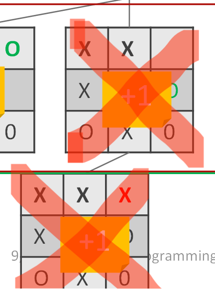

Hier zal er een minimum worden genomen van –1 en iets anders. Je hoeft de andere opties dus zelfs niet uit te pluizen, het zal altijd –1 zijn

---

## X

O
X
0
X
O
X
X
O
X
0
X
O
X
X
O
X
0
X
O
X
X
O
X
0
X
O
O
X
X
O
X
0
X
O
X
X
O
O
X
0
X
O
X
X
X
O
O
X
0
X
O
X
O
X
O
X
0
X
O
X
X
O
O
X
0
X
O
X
O
X
X
O
X
0
X
O
X
X
X
O
O
X
0
X
O
O
X
X
O
X
0
X
O
O
X
X
O
X
0
X
O
X
O
X
X
O
X
0
X
O
X aan zet
X aan zet
O aan zet
MAX
MAX
MIN
MIN
+1
+1
+1
+1
0
‐1
‐1
‐1
‐1
0
0
0
0
0

Minimax Algoritme voor Tic Tac Toe – a-b pruning

---

## Werking alpha beta pruning

• Het algoritme houdt 2 waardes bij die het heel de tijd meegeeft aan onderliggende stappen, genaamd alpha en beta.
• Alpha is initieel -∞
• Beta is initieel +∞
• Wanneer we bij een minimizing (resp maximizing) fase een waarde tegenkomen die hoger is dan beta (resp lager dan alpha), dan moeten we die niet doorlopen
• Dat is in algoritme als beta < alpha
• Bij elke stap updaten we ook alpha en beta

---

## Nog een voorbeeld

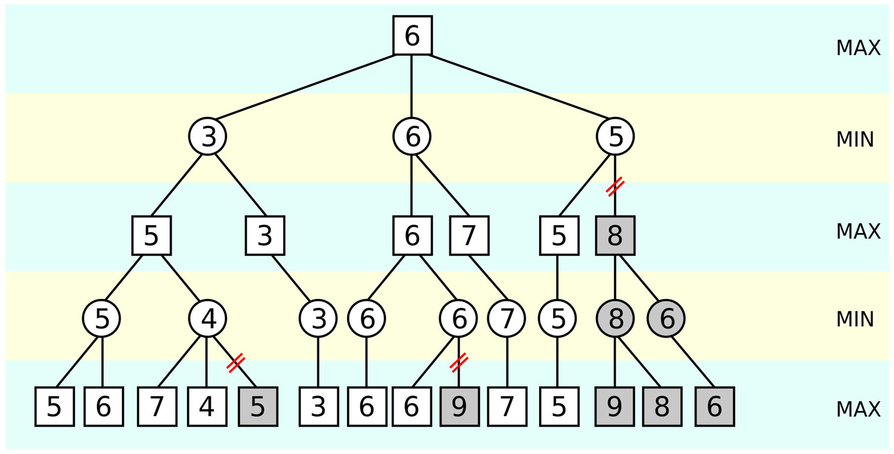

---

## Alpha beta pruning

• Parameters meegeven in de minimax def minimax(self, depth, is_maximizing, alpha, beta): #maximizing best = max(best, new_move.minimax(depth + 1, not is_maximizing, alpha, beta)) #tegengestelde positie alpha = max(alpha, best) if beta <= alpha: break # alpha pruning # minimizing best = min(best, new_move.minimax(depth + 1, not is_maximizing, alpha, beta)) beta = min(beta, best) if beta < alpha: break: # beta pruning

---

## Alpha beta pruning

• Snijdt stukken weg zonder de uiteindelijke uitkomst van minimax te wijzigen
• Dit is dus altijd efficiënt om te implementeren!
• In tegenstelling tot depth- limited oplossingen, blijft alpha-beta pruning een exacte oplossing garanderen
• Uiteraard kan je alpha beta pruning én depth- limited combineren

---

## Wat met stochastische spellen

?

---

## Minimax is pessimistisch

• Minimax gaat ervan uit dat de tegenstrever perfect speelt
• Dit is niet altijd zo
• Hetzij door menselijke fouten
• Hetzij omdat er een fundamentele kanscomponent is, zoals gooien met een dobbelsteen
• Het is dan niet meer zo slim om altijd pessimistisch te redeneren zoals minimax
• We kunnen ook kanstheoretisch beginnen redeneren, en dan bekomen we expectimax

---

## Notatie in diagrammen

• Om dingen overzichtelijk te houden:
• Driehoek boven voor
Max
• Driehoek onder voor
Min
• Cirkel voor kans
• Een proces van dobbelstenen gooien is dus:

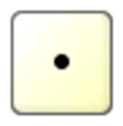

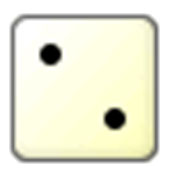

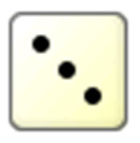

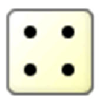

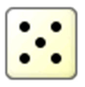

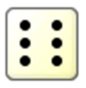

---

## Oorzaken van een kanstheoretisch process

• Onderliggende kansactie
• Dobbelsteen gooien,
• Kaart trekken,
• Random initialisatie bij computerspel,
• …
• Dus bij een stochastisch = niet-determinitische situatie
• Indien geen zicht op state van tegenspeler (imperfect information)
• Poker
• Solitaire
• 21'en
• Je kan je vermoedens over de opties van de tegenstrever in dit model gieten

---

## Expectimax

• Expectimax is hetzelfde als minimax, maar in plaats van een minimum/maximum te nemen, neem je voor de kansopties de verwachte waarde (expected value) gebaseerd op de kansverdeling.

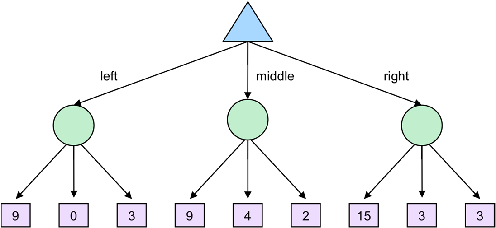

---

## Expectimax

• Indien alle opties hieronder evenveel kans hebben, is dat dus links
9 * 1/3 + 0 * 1/3 + 3 * 1/3 = 4

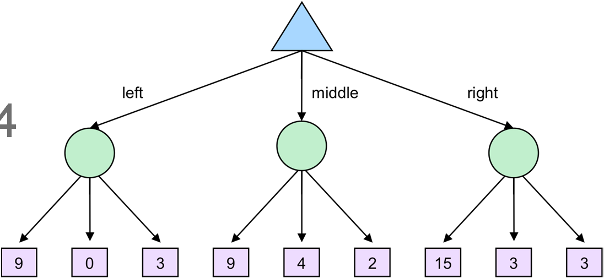

---

## Verschillen minimax, expectimax

• Minimax gaat uit van een ideale tegenstrever, die exact weet wat hij/zij doet
• Minimax is typisch voor zero-sum games
• Perfect information games
• De evaluatiefunctie is statisch
• Expectimax is voor spellen met onzekerheid
• Of voor tegenstrevers waarvan geweten is dat ze een bepaald percentage fouten maken
• Inperfect, stochastic games
• om game states te schatten is er naast een evaluatiefunctie ook een kansverdeling nodig voor elke mogelijke set acties
