<!-- _class: title-slide -->

# Linear Programming

---

## Continue zoekruimtes

• Tot nu toe werkten we altijd met ‘discrete’ zoekruimtes, waar er van een bepaalde state een eindig aantal nieuwe stappen waren
• Nu kijken we naar problemen met een continue set aan variabelen
• We kijken naar een specifiek soort problemen:
Lineaire optimisatie modellen (met een kwadratische kost)
• Deze problemen hebben altijd een paar variabelen, iets wat we willen minimaliseren (een kostfunctie) en bepaalde randvoorwaarden

---

## Voorbeeldprobleem – lineaire variabelen

• In een (nogal speciale) boerderij zitten kippen, neushoorns en geiten
• Stel dat er 12 hoofden, 38 voeten en 10 hoorns zijn.
• Hoe lossen we dit probleem op ?
• Variabelen:
• k = aantal kippen
• n = aantal neushoorns
• g = aantal geiten

---

## Voorbeeldprobleem

• 12 hoofden:
•
• 38 voeten
•
• 10 hoorns
•
• Hoe lossen we dit probleem op ?
• Variabelen:
• k = aantal kippen
• n = aantal neushoorns
• g = aantal geiten

---

## Voorbeeldprobleem

• 12 hoofden:
•
• 38 voeten
•
• 10 hoorns
•
• Hoe lossen we dit probleem op ?
• Variabelen:
• k = aantal kippen
• n = aantal neushoorns
• g = aantal geiten
1
1
1
2
4
4
0
1
2
ൈ 𝑘 𝑛 𝑔
ൌ
12
38
10
In Matrixnotatie
Elke rij stelt een vergelijking voor
Elke kolom gaat over een specifieke variabele

---

## Voorbeeldprobleem

• Dit probleem heeft een exacte oplossing:
• K = 5
• N = 4
• G = 3
• Maar vaak zijn er veel meer oplossingen, en zijn er extra randvoorwaarden
1
1
1
2
4
4
0
1
2
ൈ 𝑘 𝑛 𝑔
ൌ
12
38
10

---

## Ter info: dit is wat chatGPT ervan bakte:

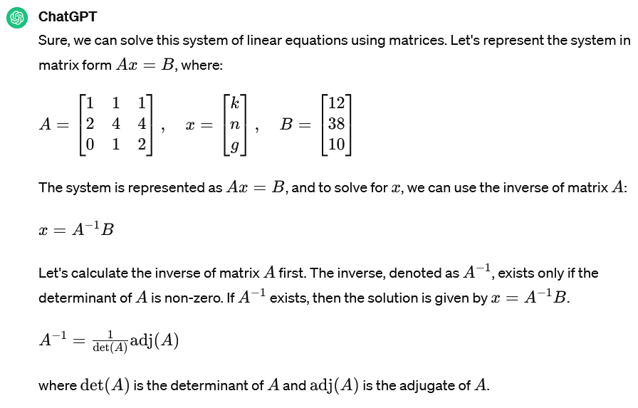

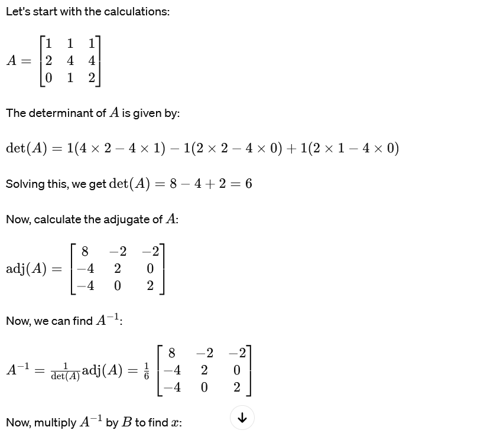

---

## Ter info: dit is wat chatGPT ervan bakte:

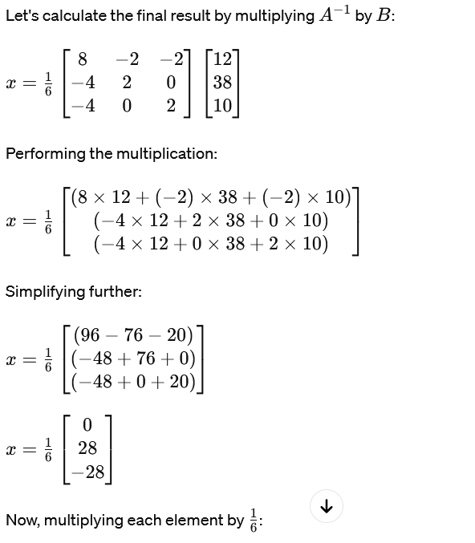

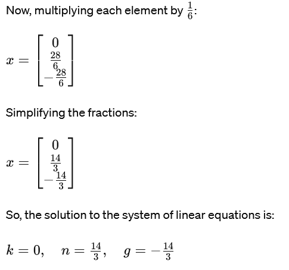

---

## Bij een tweede poging, nog steeds fout

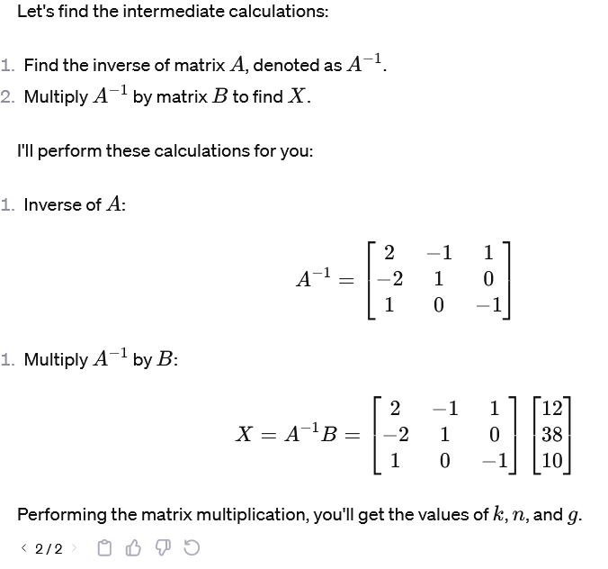

Hierna ben ik gestopt, en overgestapt op mijn klassiek rekenmachine

---

## Voorbeeldprobleem - randvoorwaarden

• 12 hoofden:
•
• 38 voeten
•
• Minstens 5 hoorns in totaal
• Hoe lossen we dit aangepaste probleem op
?
• Variabelen:
• k = aantal kippen
• n = aantal neushoorns
• g = aantal geiten

---

## Voorbeeldprobleem - randvoorwaarden

• 12 hoofden:
•
• 38 voeten
•
• Minstens 5 hoorns in totaal
• Hoe lossen we dit aangepaste probleem op
?
• Variabelen:
• k = aantal kippen
• n = aantal neushoorns
• g = aantal geiten 𝑛 ൅2𝑔 ൒5

---

## Voorbeeldprobleem - randvoorwaarden

• We passen de vergelijking aan
• Eerst splitsen we de gelijkheid op in twee ongelijkheden
• Dan vullen we de nieuwe informatie in
• Tot slot is er voor de laatste vergelijking geen bovengrens, dus zetten we daar (+∞)
• 1
1
1
2
4
4
0
1
2
ൈ 𝑘 𝑛 𝑔
ൌ
12
38
• 12
38

൑
1
1
1
2
4
4
0
1
2
ൈ 𝑘 𝑛 𝑔
൑
12
38
• 12
38
5
൑
1
1
1
2
4
4
0
1
2
ൈ 𝑘 𝑛 𝑔
൑
12
38
• 12
38
5
൑
1
1
1
2
4
4
0
1
2
ൈ 𝑘 𝑛 𝑔
൑
12
38
൅∞

---

## Voorbeeldprobleem - randvoorwaarden

• Deze systemen hebben vaak meerdere oplossingen
• Dus is er ook altijd sprake van het zoeken naar een optimale oplossing
• Dwz, er is een kostfunctie, bijvoorbeeld
• ଵ
ଶ𝑘 𝑛 𝑔
1
0
0
0
50
0
0
0
2 𝑘 𝑛 𝑔
൅0
0
1 𝑘 𝑛 𝑔
• =
௞మାହ଴௡మାଶ௚మ
ଶ ൅𝑔
• 12
38
െ∞
൑
1
1
1
2
4
4
0
1
2
ൈ 𝑘 𝑛 𝑔
൑
12
38
5

---

## Voorbeeldprobleem - randvoorwaarden

• Visueel zoeken we oplossing van snijdende vlakken in de ruimte
• De kostfunctie zorgt ervoor dat 1 bepaald punt de allerbeste oplossing wordt

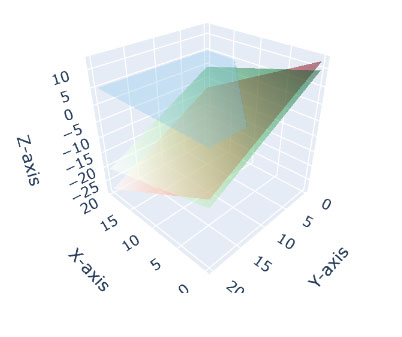

---

## Algemeen probleem

• We lossen problemen op met
• Variabelen: dingen waarvan we de waarde willen weten
• Minimalisatie: we willen een kostfunctie minimaliseren
• Constraints: Er zijn voorwaarden (gelijkheden of ongelijkheden) om mee rekening te houden
Algemene Vorm:
Minimaliseer
1 2 𝑥்𝑃𝑥൅𝑞்𝑥
P en q liggen vast door het probleem. Deze bepalen volledig de kostfunctie.
Met constraints: 𝑙൑𝐴𝑥൑𝑢
Hierbij zijn l en u de lower en upper bound (ondergrens en bovengrens)

---

## Library gebruiken - OSQP

• https://osqp.org/docs/get_ started/python.html
• Zelf verantwoordelijk voor het opzetten van de matrices – dit is het moeilijkste !
• Hier gaan we op oefenen in het oefenlabo

---

## AI & verkeerskunde

Een concreet voorbeeld van linear programming in de praktijk

---

## Macroscopisch verkeersmodel

Microscopisch
Nieuwe technieken

Verkeerskunde

---

## Macroscopische verkeersmodellen

---

## Klassiek verkeerskunde model

• Voorspellingen:
• Op basis van geografische input: woonwijken, kantoorwijken
• Hebben een exacte kaart met de hoofdwegen
• Maken gebruik van meetlussen

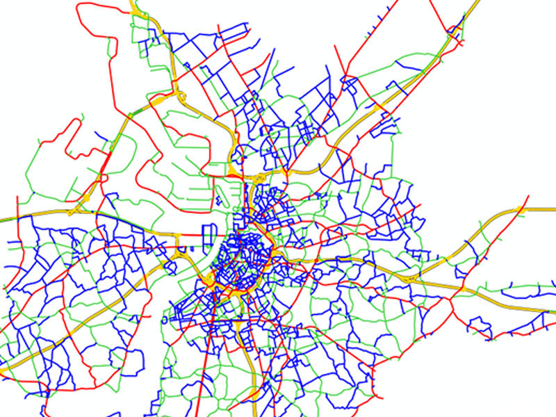

---

## Klassiek verkeerskunde model

• Meetlussen
• Magnetische strips in de grond
• AI oplossing: camerabeelden met beeldherkenning - https://www.verkeerscentru m.be/camerabeelden
• Deze meetlussen dienen als lokale ijkingspunten van de klassieke , statische verkeersmodellen

---

## AI in macroscopische modellen

• Beeldherkenning op vaste camera's
• ANPR-beeldherkenning
• Zou kunnen worden uitgebreid om rekeningrijden mogelijk te maken, maar er zijn privacybezwaren

---

## AI in macroscopische modellen: YOLO

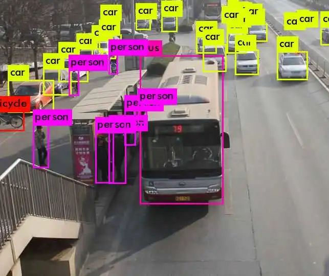

• You Only Look Once
• Gebruikt deep learning
• Blazing fast!

---

## Microscopische verkeersmodellen

---

## Microscopisch: 1 kruispunt of 1 straat

• Vroeger:
• Statistische tabellen: 25% links, 50% rechtdoor, 25% rechts
• AI: Telraam
• Data is open beschikbaar!
• Is een data-driven tool voor lokaal beleid
• Er wordt ook gekeken naar nog andere technieken: bluetooth scanners, crowdscanners met lasers

---

## Hoe werkt telraam?

• Stap 1: tweewielers vs vierwielers:
• Dit is een simpele clustering op 2 dimensies:
• Length-width ratio
• 'fullness'
• Stap 2: autos vs grote voertuigen: na calibratie van de lengte

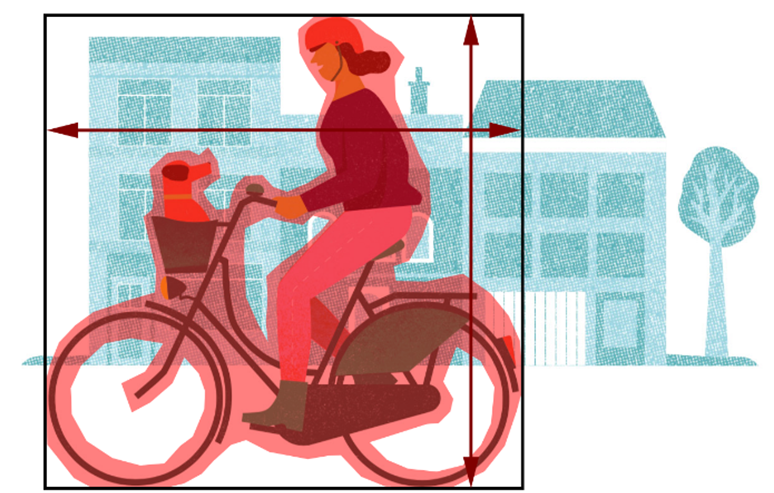

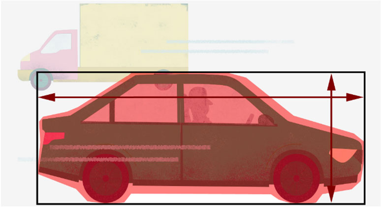

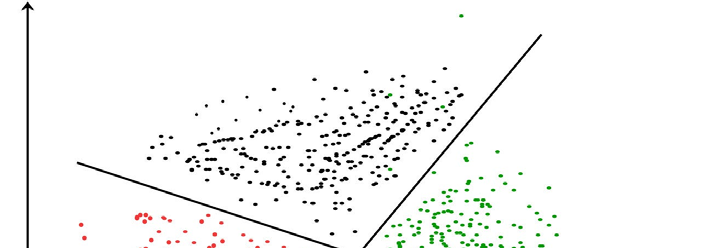

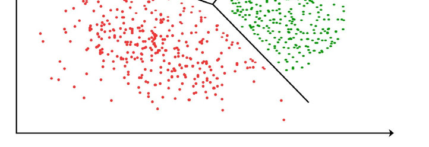

---

## Nieuwe technieken

---

## Data Fusion

• Combinatie van telco,
FCD (GPS data autos), telraam, ANPR data, velo data, parking data…
• Moet een overkoepelend beeld geven

---

## Data Fusion

• Telco: overkoepelend beeld van waar mensen zich bevinden
• Eigenlijk is dit een heel simpele AI: 1-nearest neighbor

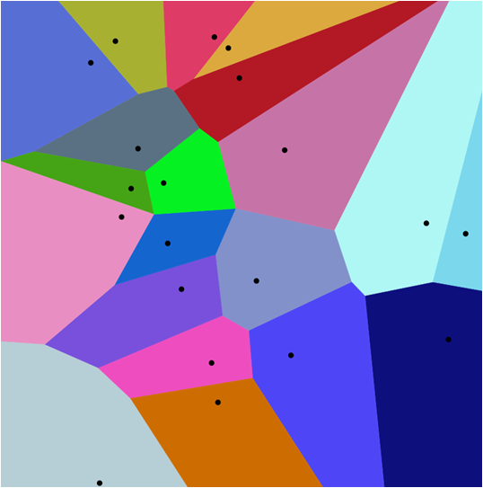

---

## Data Fusion

• Floating Car Data (FCD)
• Geeft een relatief beeld van drukte in de stad, maar geen exacte aantallen
• Google Maps Traffic heeft dit realtime geïmplementeerd

---

## Data Fusion

• Shared vehicle data
• Kunnen een beeld geven van sources en sinks

---

## Data Fusion

• (Strava) heatmaps

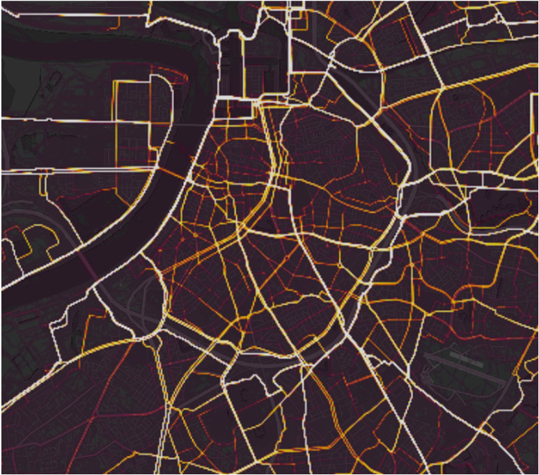

---

## Data Fusion

• ANPR: automated number plate recognition

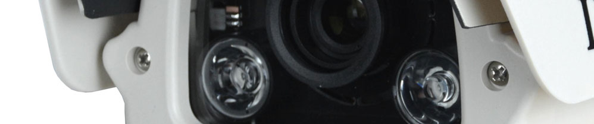

---

## Data Fusion

• Combinatie van telco,
FCD (GPS data autos), telraam, ANPR data, velo data, parking data…
• Hoe data combineren ?

---

## Data Fusion = kinderspel, knikkerspel

• Elke databron legt restricties en spreekt over bepaalde soorten verkeer – de data geeft restricties
• Deze locaties kunnen deels overlappen
• Sommige bronnen zijn nauwkeuriger dan andere – dit kan meengenomen worden in 'relaxatie' parameters
• De 'knikkers' moeten zodanig op de stratengrid worden gelegd dat ze aan zeel mogelijk criteria voldoen
• Technisch: Linear optimization model met Quadratic Cost function

